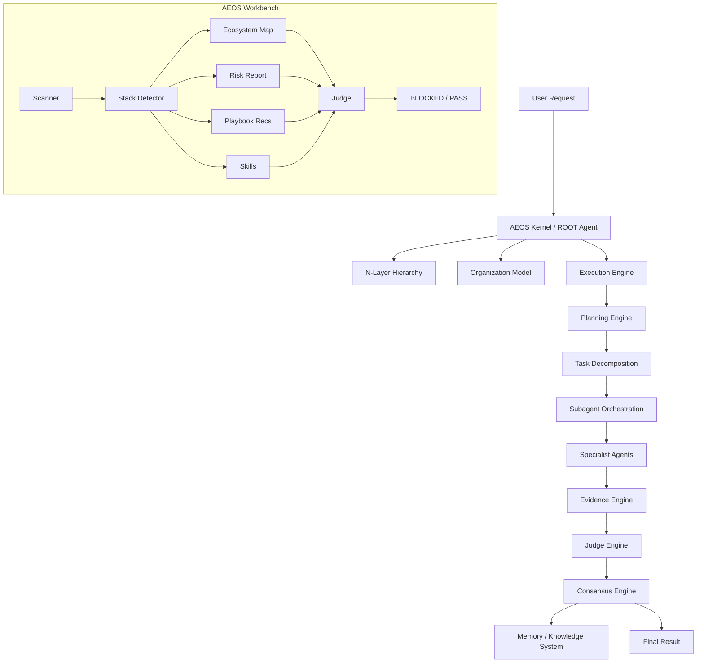

# AEOS Chief/Staff Edition + Workbench

AI Engineering Operating System — Chief/Staff Edition + Portable AI-First Engineering Environment.

AEOS is a specification-first operating system for AI agents. It treats the LLM as a reasoning component inside a governed engineering runtime, not as the entire system.

The **AEOS Workbench** extends this into a portable, governed, evidence-driven environment that can scan, analyze, and automate software ecosystems.

## Objective

Build an AI operating system capable of orchestrating software engineering, AI engineering, research, verification, governance, continuous learning and specialist agent execution with Staff/Chief-level discipline.

## Core architecture



## Included modules

- Foundation: constitution, hierarchy, organization, principles.
- Execution: planning, decomposition, orchestration, checkpoints, deep thinking.
- Reasoning: evidence, meta-reasoning, failure prediction, architecture reasoning, trade-offs, research.
- Knowledge: memory, lessons, golden knowledge, ADRs, continuous learning.
- Engineering: language discovery, language standards, architecture patterns, Clean Architecture, DDD, AI, security, observability.
- Verification: quality gates, testing, judge engine, consensus, scoring, release.
- Governance: clinical, regulatory, risk, security governance, human-in-the-loop.
- Operations: commands, playbook, self-improvement, runtime.
- Protocols, schemas, templates and examples.
- **Workbench**: ecosystem scanner, stack detector, risk analysis, skill factory, playbook engine, judge layer.

## Installation

### Specification-first layout

```text
.aeos/
├── AGENT.md
├── foundation/
├── execution/
├── reasoning/
├── knowledge/
├── engineering/
├── verification/
├── governance/
├── operations/
├── protocols/
├── schemas/
├── templates/
└── examples/
```

Point your AI coding agent to `.aeos/AGENT.md`.

### Workbench MVP (Python)

```bash
cd workbench/Mvp
pip install -e .
aeos full-scan --path /path/to/project
```

### Runtime Core (TypeScript)

```bash
cd runtime
npm install && npm run build
```

## Operating posture

The ROOT Agent is not a naive coder. It is the AI kernel and Chief/Staff orchestrator of the engineering organization.
