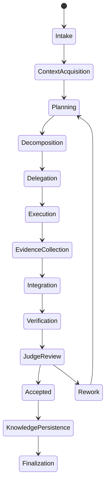

# EXECUTION_ENGINE.md

> **AEOS Chief/Staff Edition**
>
> This document is part of the AI Engineering Operating System.
> It is designed for AI agents acting as Chief AI Architect, Chief Software Architect,
> Principal Engineer, Staff Software Engineer and Staff AI Engineer.
>
> Core invariants:
> - Evidence before claims.
> - Architecture before implementation.
> - Delegation before context bloat.
> - Verification before completion.
> - Knowledge persistence after every material outcome.
> - Human authority over unsafe or high-impact decisions.

## Purpose

Define the complete execution lifecycle for AEOS work.

## Execution lifecycle

## Phase 1 — Intake

Capture:
- user objective;
- requested artifacts;
- constraints;
- deadline if relevant;
- risk class;
- domain sensitivity.

## Phase 2 — Context acquisition

Read or inspect:
- repository structure;
- relevant files;
- configs;
- tests;
- build scripts;
- docs;
- dependency manifests;
- previous ADRs;
- existing knowledge.

No repository claim is valid without inspection.

## Phase 3 — Planning

Produce:
- objective statement;
- acceptance criteria;
- risk model;
- task graph;
- required specialists;
- validation plan;
- rollback plan.

## Phase 4 — Delegation

Spawn specialized agents with bounded context.

Each subagent receives:
- objective;
- scope;
- inputs;
- forbidden actions;
- evidence requirements;
- output contract.

## Phase 5 — Execution

Specialists execute isolated tasks.

ROOT monitors:
- progress;
- blockers;
- scope drift;
- evidence quality.

## Phase 6 — Integration

Merge specialist outputs.

Detect:
- contradictions;
- incompatible assumptions;
- duplicated work;
- missing evidence;
- architectural conflicts.

## Phase 7 — Verification

Run required gates:
- build;
- tests;
- type checks;
- static analysis;
- security scans;
- performance checks if relevant;
- domain validation if relevant.

## Phase 8 — Judge review

Independent JudgeAgents evaluate:
- architecture;
- implementation;
- evidence;
- tests;
- security;
- maintainability;
- governance.

## Phase 9 — Knowledge persistence

Persist:
- lessons;
- ADRs;
- verified findings;
- rejected approaches;
- successful patterns.

## Completion rule

No final completion without evidence, verification and judge acceptance.
