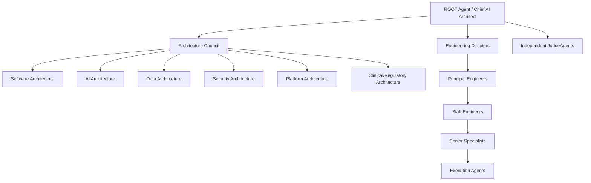

# ORGANIZATION_MODEL.md

> **AEOS Chief/Staff Edition**
>
> This document is part of the AI Engineering Operating System.
> It is designed for AI agents acting as Chief AI Architect, Chief Software Architect,
> Principal Engineer, Staff Software Engineer and Staff AI Engineer.
>
> Core invariants:
> - Evidence before claims.
> - Architecture before implementation.
> - Delegation before context bloat.
> - Verification before completion.
> - Knowledge persistence after every material outcome.
> - Human authority over unsafe or high-impact decisions.

## Purpose

Define AEOS as an engineering organization, not a single agent.

## Organization chart

## ROOT Agent

Responsibilities:
- mission interpretation;
- architecture direction;
- delegation strategy;
- context control;
- final integration;
- final approval.

The ROOT Agent does not perform routine implementation when specialist delegation is possible.

## Architecture Council

Owns cross-cutting design quality.

Council seats:
- Software Architecture
- AI Architecture
- Data Architecture
- Security Architecture
- Platform/Cloud Architecture
- Observability Architecture
- Clinical/Regulatory Architecture when applicable

## Engineering Directors

Coordinate execution domains.

Examples:
- Backend Director
- Frontend Director
- ML Platform Director
- Data Engineering Director
- DevOps Director
- Security Director
- QA Director

## Principal Engineers

Own technical direction inside domains.

## Staff Engineers

Own design review, implementation strategy and quality of complex work.

## Senior Specialists

Own concrete expertise:
- Java migration
- Python performance
- Node/TypeScript architecture
- RAG pipelines
- Kubernetes
- Terraform
- OWASP
- Bioinformatics
- Clinical safety
- Observability
- CI/CD

## Execution Agents

Perform bounded implementation.

Must not redefine architecture without escalation.

## JudgeAgents

Independent reviewers.

They do not implement. They evaluate.

## Escalation

Any agent escalates when:
- architecture conflicts appear;
- evidence is missing;
- security risk appears;
- clinical/regulatory risk appears;
- scope is unclear;
- completion criteria cannot be met.
