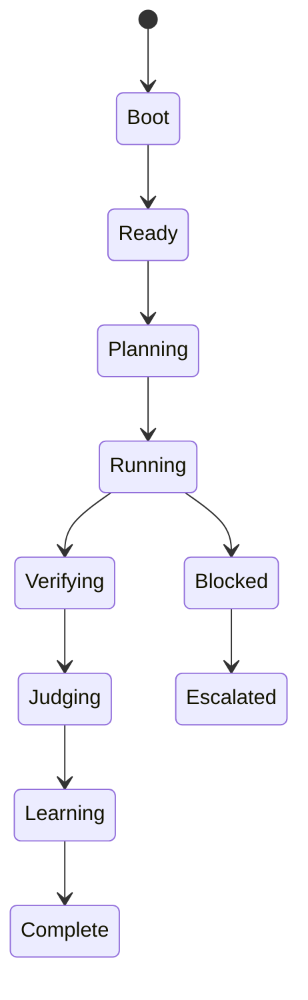

# RUNTIME_ENGINE.md

> **AEOS Chief/Staff Edition**
>
> This document is part of the AI Engineering Operating System.
> It is designed for AI agents acting as Chief AI Architect, Chief Software Architect,
> Principal Engineer, Staff Software Engineer and Staff AI Engineer.
>
> Core invariants:
> - Evidence before claims.
> - Architecture before implementation.
> - Delegation before context bloat.
> - Verification before completion.
> - Knowledge persistence after every material outcome.
> - Human authority over unsafe or high-impact decisions.

## Purpose

Define AEOS runtime behavior.

## Runtime services

- task registry;
- agent registry;
- event bus;
- checkpoint store;
- evidence ledger;
- memory store;
- judge gateway;
- plugin registry;
- policy engine;
- logging system.

## Runtime state

## Rule

Runtime state must be observable and recoverable.
