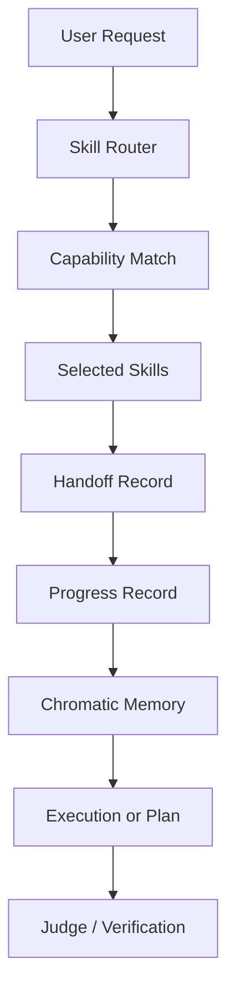

# AEOS No-Python Skill Orchestration

## Intent

AEOS must evolve into a skill-orchestrated WorkspaceSO where user requests are
routed to the best available skills automatically. The user must not need to
name the skill unless they want to override routing.

## Immutable Rules

1. New AEOS runtime orchestration must be implemented in Node/TypeScript or
   declarative skill/playbook contracts.
2. Python is retired from the active WorkspaceSO runtime path.
3. Existing Python files are legacy inventory until each capability is ported,
   replaced, or intentionally removed.
4. Every routed request must write Chromatic Mega Brain memory artifacts:
   `MEMORY.md`, `LEARNING.md`, `HANDOFF.md`, and `PROGRESS.md`.
5. A request may not be considered complete when routing, handoff, progress, or
   memory persistence failed.
6. Skill selection is automatic by default and explicit by override.
7. Architecture-changing work requires explicit user intent.
8. Skill creation must use the project skill builder/factory contract.

## Runtime Model

## Skill Routing Contract

The router must inspect:

- skill id;
- mission;
- capabilities;
- owner agent;
- risk level;
- skill path;
- request keywords;
- explicit user constraints.

The router output must include:

- selected skills;
- rejected skills when relevant;
- assumptions;
- routing evidence;
- memory write result;
- handoff target;
- progress status.

## Python Retirement Contract

Python files are not deleted blindly. A file is retired only after one of these
conditions is true:

- equivalent Node/TypeScript implementation exists and is tested;
- the capability was superseded by a skill/playbook contract;
- the file is historical reference and moved under `references/legacy-python`;
- the capability is removed with a documented rollback path.

## Production Gate

Before declaring no-Python readiness:

1. `node scripts/aeos-skill-router.mjs "health check"` succeeds.
2. `node scripts/aeos-no-python-guard.mjs` reports zero active Python runtime
   blockers.
3. `npm --prefix runtime run build` succeeds.
4. All active Node tests pass.
5. Chromatic memory files are updated for the execution.
