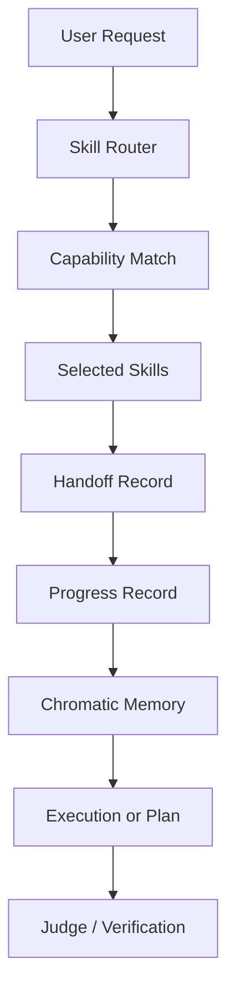

# AEOS Python Workspace Policy

## Intent

AEOS remains a skill-orchestrated WorkspaceSO. User requests are routed to the
best available skills automatically. The user does not need to name a skill
unless they want to override routing.

Python is allowed in this workspace. Skill-local validators, project sources,
packaging metadata and tests may use Python. The kernel/runtime orchestration
path stays Node/TypeScript plus declarative skill/playbook contracts unless a
later mission explicitly migrates a runtime surface.

## Immutable Rules

1. New AEOS kernel/runtime orchestration stays in Node/TypeScript or
   declarative skill/playbook contracts unless the user explicitly authorizes a
   runtime-language change.
2. Python source and project metadata are allowed in the workspace.
3. Skill-local Python scripts (`skills/*/scripts/*.py`) are first-class gates
   when the owning skill declares them.
4. Every routed request must write Chromatic Mega Brain memory artifacts:
   `MEMORY.md`, `LEARNING.md`, `HANDOFF.md`, and `PROGRESS.md`.
5. A request may not be considered complete when routing, handoff, progress, or
   memory persistence failed.
6. Skill selection is automatic by default and explicit by override.
7. Architecture-changing work requires explicit user intent.
8. Skill creation must use the project skill builder/factory contract.

## Runtime Model

## Skill Routing Contract

The router must inspect:

- skill id;
- mission;
- capabilities;
- owner agent;
- risk level;
- skill path;
- request keywords;
- explicit user constraints.

The router output must include:

- selected skills;
- rejected skills when relevant;
- assumptions;
- routing evidence;
- memory write result;
- handoff target;
- progress status.

## MCP and LSP Adapter Contract

MCPs and LSPs keep their capabilities, but they are adapter surfaces consumed by
skills. They must not decide scope, architecture, implementation strategy, or
completion status alone.

Required adapter fields:

- MCP: `governing_skill`, `skill_enforced: true`, `skill_intent`.
- LSP profile: `governing_skill`.

Runtime enforcement:

- `ToolRouter` blocks MCP calls without an active AEOS skill context.
- `PlaybookEngine` sets the active skill while executing each skill.
- Tool-call evidence includes `skillId` and `governingSkill`.
- `scripts/aeos-skill-adapter-guard.mjs` validates MCP/LSP registry coverage.

## Python Allowance Contract

The workspace may contain:

- `*.py` and compiled `*.pyc` caches;
- `pyproject.toml`, `pytest.ini`, `behave.ini`;
- `requirements*.txt` and other Python lock/metadata files.

Python in skills does not create a second agent identity. Scripts remain tools
of `codenavi-agent`. Invoke skill scripts from the skill directory that ships
them; project data such as `.specs/` stays relative to the consuming project.

## Production Gate

Before declaring workspace readiness:

1. `node scripts/aeos-skill-router.mjs "health check"` succeeds.
2. `node scripts/aeos-python-workspace-guard.mjs` reports `status: PASS` with
   Python allowed.
3. `node scripts/aeos-skill-adapter-guard.mjs` validates MCP/LSP skill governance.
4. `npm --prefix runtime run build` succeeds.
5. All active Node tests pass.
6. Chromatic memory files are updated for the execution.
