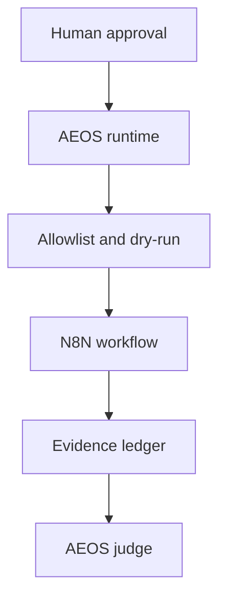

# N8N Architecture

N8N is an optional orchestration adapter around the AEOS runtime. AEOS remains the source of policy, permissions, specifications, evidence and final decisions.

Credentials stay in environment-backed secret stores and are never embedded in configuration or payloads. Remote endpoints require HTTPS. Correlation IDs connect requests, logs and evidence.
