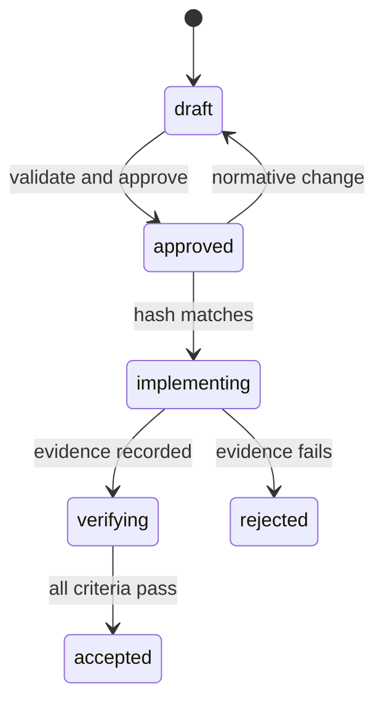

# Spec-Driven Development Architecture

The canonical source is `.aeos-runtime/specs/<slug>/spec.json`. Markdown and traceability documents are generated views and must not become competing sources of truth.

Approval contains the actor, evidence reference, timestamp and normative SHA-256. Any change to objective, revision, requirements, criteria, risks or out-of-scope invalidates that approval. N8N may orchestrate work but cannot approve or accept a specification.
