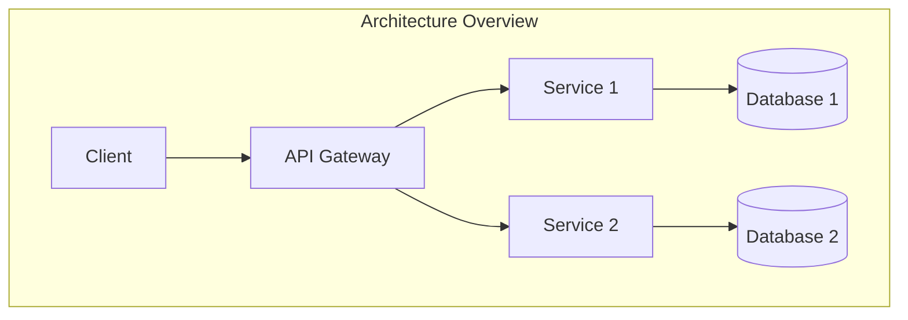

# Visão do Desenvolvedor

## Stack Tecnológica

| Categoria | Tecnologia | Versão | Arquivos de Referência |
|-----------|------------|--------|------------------------|
| Linguagem | <!-- linguagem --> | <!-- versão --> | <!-- arquivos --> |
| Framework | <!-- framework --> | <!-- versão --> | <!-- arquivos --> |
| Banco de Dados | <!-- banco --> | <!-- versão --> | <!-- arquivos --> |
| Cache | <!-- cache --> | <!-- versão --> | <!-- arquivos --> |
| Mensageria | <!-- mensageria --> | <!-- versão --> | <!-- arquivos --> |
| Cloud | <!-- cloud --> | <!-- versão --> | <!-- arquivos --> |

## Arquitetura



## Setup do Projeto

```bash
# Clone
git clone <repo-url>
cd <project-name>

# Instalar dependências
npm install
# ou
pip install -r requirements.txt

# Configurar variáveis de ambiente
cp .env.example .env
# Editar .env com suas configurações

# Iniciar em desenvolvimento
npm run dev
# ou
python manage.py runserver
```

## Estrutura de Diretórios

```
src/
├── api/          # Rotas e controllers
├── services/     # Lógica de negócio
├── models/       # Modelos de dados
├── middleware/    # Middleware
├── config/       # Configurações
├── utils/        # Utilitários
└── types/        # Definições de tipos
```

## API Contract

### Endpoints

| Método | Rota | Descrição | Auth | Request | Response |
|--------|------|-----------|------|---------|----------|
| GET | /api/<!-- recurso --> | <!-- descrição --> | <!-- sim/não --> | <!-- params --> | <!-- schema --> |
| POST | /api/<!-- recurso --> | <!-- descrição --> | <!-- sim/não --> | <!-- body --> | <!-- schema --> |

### Modelos de Dados

```typescript
interface User {
  id: string;
  name: string;
  email: string;
  createdAt: Date;
}
```

## Estratégia de Testes

| Tipo | Framework | Cobertura | Comando |
|------|-----------|-----------|---------|
| Unitários | Jest | <!-- % --> | npm test |
| Integração | Supertest | <!-- % --> | npm run test:integration |
| E2E | Cypress | <!-- % --> | npm run test:e2e |

## Guia de Contribuição

1. Fork o repositório
2. Crie uma branch: `git checkout -b feature/nome`
3. Commit suas mudanças: `git commit -m 'feat: descrição'`
4. Push: `git push origin feature/nome`
5. Abra um Pull Request

## Deploy

```bash
# Build
npm run build

# Deploy para staging
npm run deploy:staging

# Deploy para produção
npm run deploy:production
```
