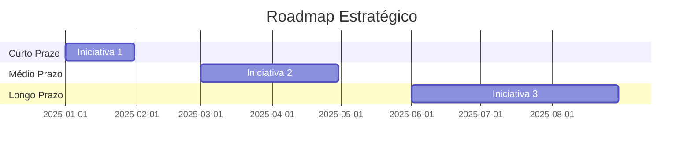

# Visão da Diretoria

## Executive Summary

> Análise estratégica da arquitetura do projeto, saúde técnica, riscos, maturidade e recomendações para a liderança de tecnologia.

## Saúde Arquitetural

| Dimensão | Nota (0-10) | Status | Comentário |
|----------|-------------|--------|------------|
| Escalabilidade | <!-- nota --> | 🟢🟡🔴 | <!-- comentário --> |
| Performance | <!-- nota --> | 🟢🟡🔴 | <!-- comentário --> |
| Segurança | <!-- nota --> | 🟢🟡🔴 | <!-- comentário --> |
| Manutenibilidade | <!-- nota --> | 🟢🟡🔴 | <!-- comentário --> |
| Testabilidade | <!-- nota --> | 🟢🟡🔴 | <!-- comentário --> |
| Observabilidade | <!-- nota --> | 🟢🟡🔴 | <!-- comentário --> |
| Documentação | <!-- nota --> | 🟢🟡🔴 | <!-- comentário --> |
| Maturidade DevOps | <!-- nota --> | 🟢🟡🔴 | <!-- comentário --> |

## Dívida Técnica

| Item | Impacto | Esforço Estimado | Prioridade |
|------|---------|-----------------|------------|
| <!-- item --> | Alto/Médio/Baixo | <!-- homem-dias --> | Crítica/Alta/Média/Baixa |

## Análise de Riscos Técnicos

| Risco | Probabilidade | Impacto | Mitigação Recomendada |
|-------|--------------|---------|----------------------|
| <!-- risco --> | Alta/Média/Baixa | Alto/Médio/Baixo | <!-- ação --> |

## Maturidade de Segurança

| Controle | Implementado | Observação |
|----------|-------------|------------|
| Autenticação | ✅ / ❌ | <!-- obs --> |
| Autorização (RBAC) | ✅ / ❌ | <!-- obs --> |
| Criptografia em Trânsito | ✅ / ❌ | <!-- obs --> |
| Criptografia em Repouso | ✅ / ❌ | <!-- obs --> |
| Audit Logs | ✅ / ❌ | <!-- obs --> |
| Rate Limiting | ✅ / ❌ | <!-- obs --> |
| WAF | ✅ / ❌ | <!-- obs --> |
| Secrets Management | ✅ / ❌ | <!-- obs --> |

## Postura de Escalabilidade

| Aspecto | Situação Atual | Recomendação |
|---------|---------------|--------------|
| Horizontal Scaling | <!-- atual --> | <!-- recomendação --> |
| Database Sharding | <!-- atual --> | <!-- recomendação --> |
| Caching | <!-- atual --> | <!-- recomendação --> |
| CDN | <!-- atual --> | <!-- recomendação --> |

## Recomendações Estratégicas

### Curto Prazo (0-3 meses)
1. <!-- recomendação -->
2. <!-- recomendação -->

### Médio Prazo (3-6 meses)
1. <!-- recomendação -->
2. <!-- recomendação -->

### Longo Prazo (6-12 meses)
1. <!-- recomendação -->
2. <!-- recomendação -->

## Estimativa de Recursos

| Iniciativa | Equipe | Duração | Custo Estimado |
|------------|--------|---------|----------------|
| <!-- iniciativa --> | <!-- qtd pessoas --> | <!-- semanas --> | <!-- valor --> |

## Roadmap

