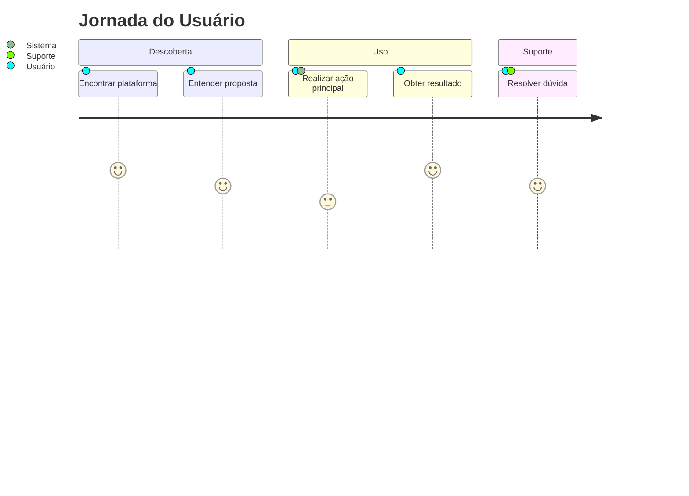

# Visão de Negócio

## Resumo Executivo

> Este documento apresenta a visão de negócio do projeto, descrevendo seu propósito, capacidades, valor gerado e riscos envolvidos, em linguagem acessível para stakeholders não-técnicos.

## Propósito do Projeto

<!-- Descrição do propósito do projeto em linguagem de negócio -->

## Capacidades de Negócio

| Capacidade | Descrição | Valor Gerado |
|------------|-----------|--------------|
| <!-- nome --> | <!-- descrição --> | <!-- valor --> |

## Jornada do Usuário

## KPIs Principais

| Indicador | Meta Atual | Benchmark | Status |
|-----------|------------|-----------|--------|
| <!-- KPI --> | <!-- valor --> | <!-- referência --> | 🟢 🟡 🔴 |

## Análise de Risco

| Risco | Probabilidade | Impacto | Mitigação |
|-------|--------------|---------|-----------|
| <!-- risco --> | Alta/Média/Baixa | Alto/Médio/Baixo | <!-- ação --> |

## Compliance e Conformidade

<!-- Listar regulamentações aplicáveis (LGPD, HIPAA, etc.) e status de conformidade -->

## Próximos Passos

1. <!-- próximo passo -->
2. <!-- próximo passo -->
3. <!-- próximo passo -->
